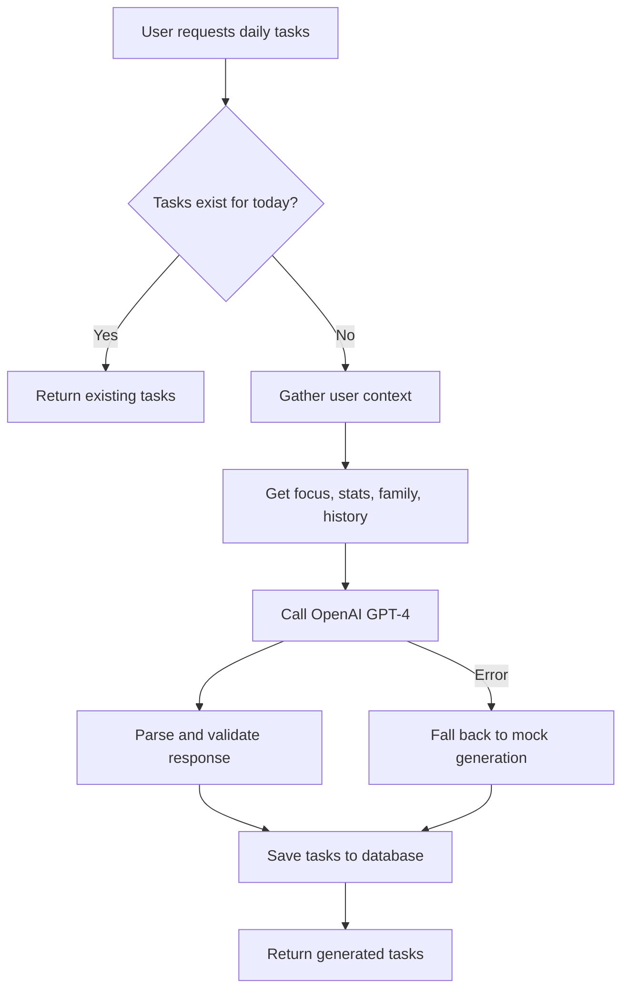

# GPT Task Generation System - Implementation Guide

## Overview

The GPT Task Generation system creates personalized daily tasks that adapt to your focus areas, family relationships, and emotional feedback. This guide covers the complete implementation and usage.

## System Architecture

### Core Components

1. **`gptTaskGenerator.ts`** - Main GPT integration and task generation logic
2. **`/api/tasks/daily`** - API endpoint for getting/generating daily tasks  
3. **`/api/tasks/:id/complete`** - API endpoint for task completion with feedback
4. **Database Schema** - Tasks table with support for linked stats and family members

### Task Generation Flow



## API Usage Examples

### 1. Get Daily Tasks

```bash
GET /api/tasks/daily
Authorization: Bearer <jwt_token>
```

**Response:**
```json
{
  "tasks": [
    {
      "id": "uuid-1",
      "title": "Focus on Fitness: 20-minute strength workout",
      "description": "Today's focus is physical health. Complete a 20-minute strength training session focusing on compound movements.",
      "source": "primary",
      "taskDate": "2025-01-15",
      "status": "pending",
      "linkedStatIds": ["fitness-stat-uuid"],
      "linkedFamilyMemberIds": []
    },
    {
      "id": "uuid-2", 
      "title": "Connect with Sarah: Quality conversation time",
      "description": "Spend 15 minutes having a meaningful conversation with Sarah. Ask about her current interests or challenges.",
      "source": "connection",
      "taskDate": "2025-01-15",
      "status": "pending",
      "linkedStatIds": ["connection-stat-uuid"],
      "linkedFamilyMemberIds": ["sarah-uuid"]
    }
  ]
}
```

### 2. Complete a Task

```bash
POST /api/tasks/uuid-1/complete
Authorization: Bearer <jwt_token>
Content-Type: application/json

{
  "status": "complete",
  "completionSummary": "Completed 20-minute workout with focus on squats and push-ups",
  "feedback": "Felt great! The workout was perfectly timed and challenging but achievable.",
  "emotionTag": "satisfaction"
}
```

**Response:**
```json
{
  "task": {
    "id": "uuid-1",
    "status": "complete",
    "completedAt": "2025-01-15T10:30:00Z",
    "feedback": "Felt great! The workout was perfectly timed...",
    "emotionTag": "satisfaction"
  }
}
```

## Task Generation Context

The GPT system uses rich context to generate personalized tasks:

### User Profile
- Name and personal context
- Current focus areas and goals
- Character stats (body, mind, connection, spirit, etc.)

### Family Information
- Family member names and relationships
- Previous interaction history
- Rotation logic for balanced attention

### Historical Context
- Recent task completions/failures
- User feedback patterns
- Emotional responses to different task types

### Daily Focus
- Scheduled focus area for the day
- Related activities and goals
- Connected character stats

## Customization

### GPT Prompt Engineering

The system builds comprehensive prompts including:

```typescript
// Example context sent to GPT
{
  "user": {
    "name": "John",
    "gptContext": {"goals": ["fitness", "family_time"]}
  },
  "todaysFocus": {
    "name": "Physical Health",
    "description": "Building strength and endurance"
  },
  "userStats": [
    {"name": "Fitness", "level": 3, "xp": 250},
    {"name": "Connection", "level": 2, "xp": 150}
  ],
  "familyMembers": [
    {"name": "Sarah", "id": "uuid"}
  ],
  "recentFeedback": [
    "Workouts feel great in the morning",
    "Kids love active games together"
  ]
}
```

### Configuration Options

Set these environment variables:

```bash
# Required for GPT generation
OPENAI_API_KEY=sk-...

# Optional: Customize GPT model (default: gpt-4)
OPENAI_MODEL=gpt-4-turbo

# Optional: Temperature for creativity (default: 0.7)
OPENAI_TEMPERATURE=0.7
```

## XP and Progression System

### XP Awards
- **Task Completion**: 25 XP to all linked stats
- **Multiple Stats**: Tasks can link to multiple stats for compound benefits
- **Automatic Leveling**: Stats level up automatically based on XP thresholds

### Linking Strategy
- **Primary Tasks**: Link to focus-related stats
- **Connection Tasks**: Link to connection/spirit stats
- **Family Tasks**: Can link to both relationship and activity stats

## Error Handling & Fallbacks

### Graceful Degradation
1. **OpenAI API Failure**: Falls back to mock task generation
2. **Missing Configuration**: Warns but continues with mock tasks
3. **Invalid Responses**: Validates GPT output and retries if needed

### Monitoring
```typescript
// The system logs important events:
console.warn('OpenAI API key not configured, using mock task generation');
console.error('Error generating tasks with OpenAI:', error);
```

## Future Enhancements

### Planned Features
- [ ] Multi-language support
- [ ] Seasonal/holiday task variations  
- [ ] Integration with calendar/scheduling
- [ ] Advanced emotion tracking and analysis
- [ ] Group/family task coordination
- [ ] Achievement and milestone celebrations

### Advanced GPT Features
- [ ] Long-term goal tracking across weeks/months
- [ ] Adaptive difficulty based on completion rates
- [ ] Cross-family member task suggestions
- [ ] Integration with journal entries for deeper context

## Troubleshooting

### Common Issues

**Tasks not generating:**
- Check `OPENAI_API_KEY` is set correctly
- Verify user has focuses and stats configured
- Check server logs for API errors

**Mock tasks only:**
- System falls back to mock when OpenAI unavailable
- Check API key and internet connectivity
- Review OpenAI usage limits and billing

**XP not awarded:**
- Ensure tasks are marked as "complete" (not skipped/failed)
- Check `linkedStatIds` are valid UUIDs
- Verify stats exist in database

**Invalid task responses:**
- System validates GPT output automatically
- Falls back to mock generation on parsing errors
- Check OpenAI model supports function calling
